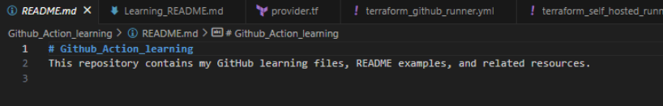
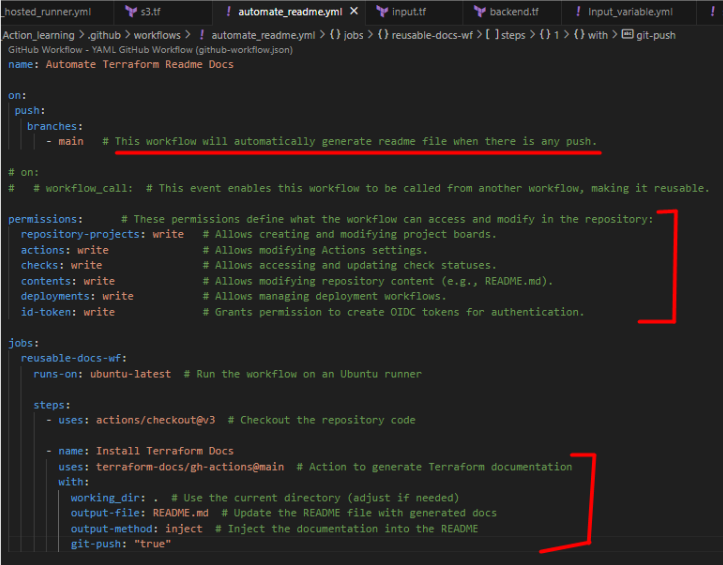
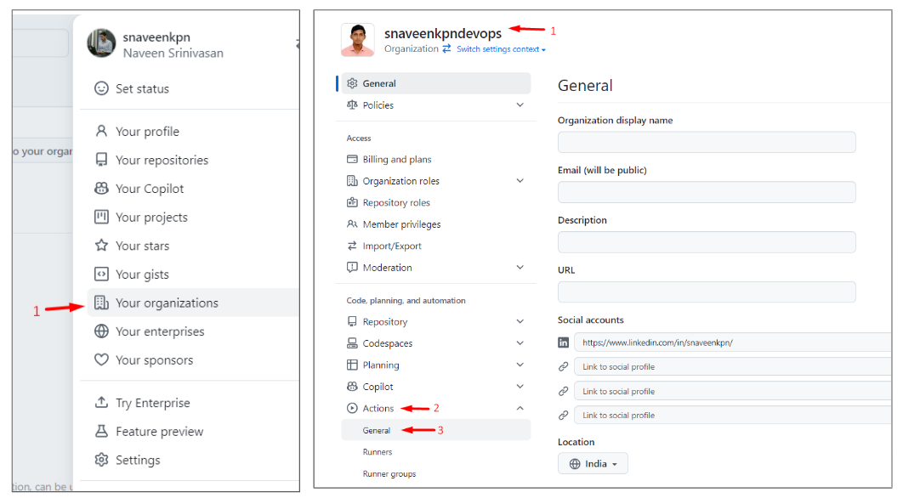
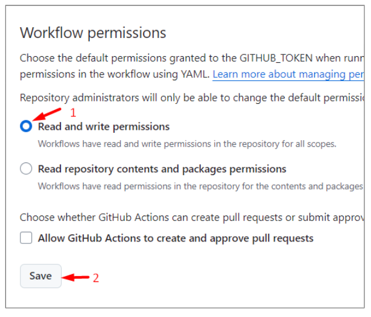
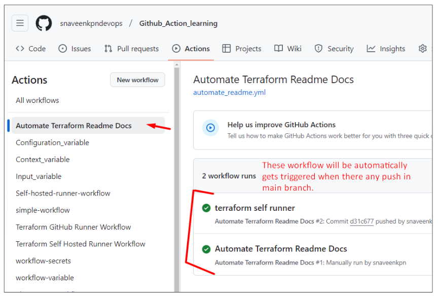
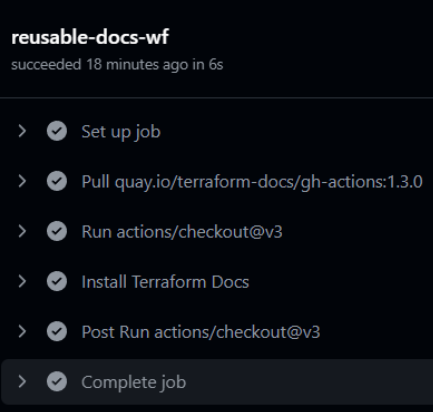
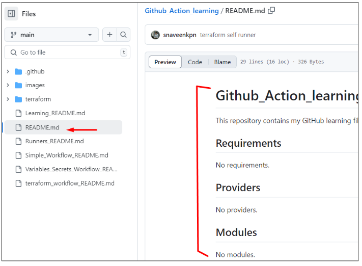

# Github_Action_learning
This repository contains my GitHub learning files, README examples, and related resources.

## Reference:

```
Youtube: TechTrapture
link:  https://www.youtube.com/watch?v=zH8hz_21x_0&list=PLLrA_pU9-Gz2GnvKN0kzVfIZVEUApgjTN

github: https://github.com/vishal-bulbule/Mastering-github-actions

```


## Note:

For Learning the Github Action, Please refer the `Learning_README.md` to check the order of Readme files.


### Automate Terraform README file creation in Github Action:

* In Organization, there will be a multiple terraform repository & maintaining the readme files which contains the modules details, number of input parameter required, variable required.  

* So maintaining all these things is not easy. So we can use a automated way to create a README file based on terraform code.


### Readme file Before running the workflow:







```

// .github/workflows/automate_readme.yml

name: Automate Terraform Readme Docs

on:
  push:
    branches: 
      - main   # This workflow will automatically generate readme file when there is any push.

# on:
#  workflow_call:  # This event enables this workflow to be called from another workflow, making it reusable.

permissions:      # These permissions define what the workflow can access and modify in the repository:
  repository-projects: write   # Allows creating and modifying project boards.
  actions: write               # Allows modifying Actions settings.
  checks: write                # Allows accessing and updating check statuses.
  contents: write              # Allows modifying repository content (e.g., README.md).
  deployments: write           # Allows managing deployment workflows.
  id-token: write              # Grants permission to create OIDC tokens for authentication.

jobs:
  reusable-docs-wf:
    runs-on: ubuntu-latest  # Run the workflow on an Ubuntu runner

    steps:
      - uses: actions/checkout@v3  # Checkout the repository code

      - name: Install Terraform Docs
        uses: terraform-docs/gh-actions@main  # Action to generate Terraform documentation
        with:
          working_dir: .  # Use the current directory (adjust if needed)
          output-file: README.md  # Update the README file with generated docs
          output-method: inject  # Inject the documentation into the README
          git-push: "true"


```


### After Pushing the automate_readme.yml file

1. We will face permission error issue while running the workflow  → To Resolve this click setting [Top Nav]
2. Click Actions
3. Click General  →  In Workflow permission  → Select Read & Write Permission
4. Click Save.














### Readme file After running the workflow:





### Note:

Now I am going to disable the push option in workflow. As for the other hands on we will be pushing lot of files, so for now i don’t want to trigger this workflow.

