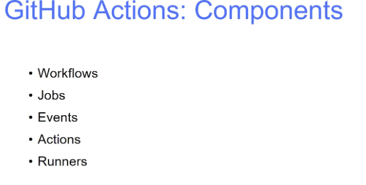

# Github_Action_learning
This repository contains my GitHub learning files, README examples, and related resources.

## Reference:

```
Youtube: TechTrapture
link:  https://www.youtube.com/watch?v=zH8hz_21x_0&list=PLLrA_pU9-Gz2GnvKN0kzVfIZVEUApgjTN
```


### Github Action Components:




1. Workflow     →  It is a simple pipeline in terms of jenkins. There will be multiple jobs and steps inside it.

                   It is defined in the  .github/workflows directory in the repository.

                   Workflows are defined by a yml file. 

2. Event        →  It is a specific activity in a repository that triggers a workflow run.

                   Ex: push a commit, new artifact build will trigger the pipeline.


3. Job          →  It is a set of steps in  a workflow that is executed on a same runner.

                   Each step is either a shell script that will be executed, or an action that will be run.


4. Runner       →  It is a server that runs your workflows when they’re triggered. Each runners can run a single job at a time.

                   Ex: Git hosted runner  (or)  self-hosted runner

5. Actions      →  It is a custom application for the github action platform.

                   Commonly used task/code. We can reuse the code again & again.
                   Ex: Checkout code, build docker application.


### Simple Workflow:


### Github Action Workflow yml Syntax Explanation:


