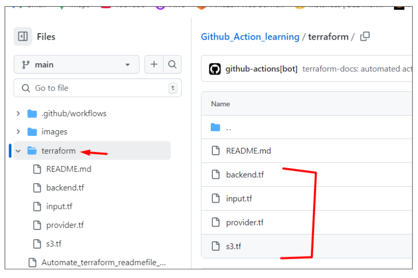

# Github_Action_learning
This repository contains my GitHub learning files, README examples, and related resources.

## Reference:

```
Youtube: TechTrapture
link:  https://www.youtube.com/watch?v=zH8hz_21x_0&list=PLLrA_pU9-Gz2GnvKN0kzVfIZVEUApgjTN

github: https://github.com/vishal-bulbule/Mastering-github-actions

```


## Note:

For Learning the Github Action, Please refer the `Learning_README.md` to check the order of Readme files.


### Reusable Workflows in Github Actions.

Suppose you are doing repeatable task in your multiple repository. We can create a separate workflow only for the particular task and we can call this workflow in our other workflow.

Ex: 1.  For Code Checkout there is a github pre-built Reusable workflow.
    2.  For Automate Terraform Readme file, we can create a new workflow for automate readme file and we can call the workflow from another workflow.

### Note:

A reusable workflow can be used by another workflow if any of the following is true:

1. Both workflows are in the same repository.
2. The called workflow is stored in a public repository, and your organization allows you to use public reusable workflows.
3. The called workflow is stored in a private repository and the settings for that repository allow it to be accessed.

In this hands on we are going to use the 3rd condition → 2 private repos.


### My-handson for Reusable workflow in Github Action.

### Prerequisite:

1. Generate access key and secret key.
2. Create a s3 bucket for storing terraform backend.
3. Make sure to run the Self-hosted runner.
4. In our local machine run → aws configure   [update the credentials]
5. Make Sure that aws cli and terraform is installed 

### Steps:

1. Create terraform files inside terraform folder (in our Github repository).
2. Create workflow yaml file for automate readme file for terraform.
3. Create workflow yaml file for creating terraform resource → In this yaml we are going to use the automate readme workflow yaml file.


### 1. Create terraform files inside terraform folder (in our Github repository).





### 2. Create workflow yaml file for automate readme file for terraform.


```

// .github/workflows/automate_readme_reusable_workflow.yml

name: automate_readme_reusable_workflow

on:
  workflow_call:  # This event enables this workflow to be called from another workflow, making it reusable.

permissions:      # These permissions define what the workflow can access and modify in the repository:
  repository-projects: write   # Allows creating and modifying project boards.
  actions: write               # Allows modifying Actions settings.
  checks: write                # Allows accessing and updating check statuses.
  contents: write              # Allows modifying repository content (e.g., README.md).
  deployments: write           # Allows managing deployment workflows.
  id-token: write              # Grants permission to create OIDC tokens for authentication.

jobs:
  reusable-docs-wf:
    runs-on: ubuntu-latest  # Run the workflow on an Ubuntu runner

    steps:
      - uses: actions/checkout@v3  # Checkout the repository code

      - name: Install Terraform Docs
        uses: terraform-docs/gh-actions@main  # Action to generate Terraform documentation
        with:
          working_dir: ./terraform  # Use the current directory (adjust if needed)
          output-file: README.md  # Update the README file with generated docs
          output-method: inject  # Inject the documentation into the README
          git-push: "true"


```


### 3. Create workflow yaml file for creating terraform resource → In this yaml we are going to use the automate readme workflow yaml file.


```
// .github/workflows/reusable_workflow.yml

name: Reusable Workflow

on:
  workflow_dispatch:  # Trigger workflow only on manual dispatch

    inputs:  # Define inputs under the workflow_dispatch event
      apply:
        description: "Terraform apply Option"
        default: "No"
        required: true

permissions:      # These permissions define what the workflow can access and modify in the repository:
  repository-projects: write   # Allows creating and modifying project boards.
  actions: write               # Allows modifying Actions settings.
  checks: write                # Allows accessing and updating check statuses.
  contents: write              # Allows modifying repository content (e.g., README.md).
  deployments: write           # Allows managing deployment workflows.
  id-token: write              # Grants permission to create OIDC tokens for authentication.


jobs:
  call-workflow-passing-data:   # Calls another reusable workflow from a specified repository and branch.
    uses: snaveenkpndevops/Github_Action_learning/.github/workflows/automate_readme_reusable_workflow.yml@main

          # In uses: url of the automate_readme.yml@branch
  
  terraform:
    name: Terraform Execution
    runs-on: self-hosted  

    steps:
      # Step 1: Checkout the repository
      - name: Checkout Code
        uses: actions/checkout@v3

      # Step 2: Initialize Terraform
      - name: Terraform Init
        working-directory: ./terraform  # Our terraform files is inside terraform folder
        run: terraform init

      # Step 3: Validate Terraform files
      - name: Terraform Validate
        working-directory: ./terraform
        run: terraform validate

      # Step 4: Terraform Plan
      - name: Terraform Plan
        working-directory: ./terraform
        run: terraform plan -out=tfplan

      # Step 5: Terraform Apply (manual trigger only)
      - name: Terraform Apply
        if: github.event.inputs.apply == 'Yes' || github.event.inputs.apply == 'yes'  # Adds a conditional manual apply option
        working-directory: ./terraform
        run: terraform apply -auto-approve tfplan


```


