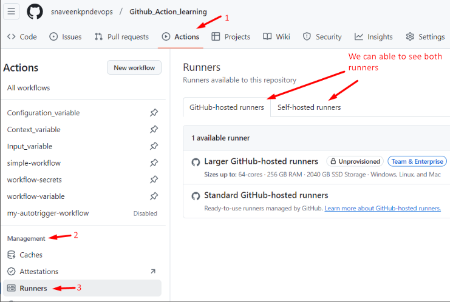

# Github_Action_learning
This repository contains my GitHub learning files, README examples, and related resources.

## Reference:

```
Youtube: TechTrapture
link:  https://www.youtube.com/watch?v=zH8hz_21x_0&list=PLLrA_pU9-Gz2GnvKN0kzVfIZVEUApgjTN
```


## Note:

For Learning the Github Action, Please refer the `Learning_README.md` to check the order of Readme files.


### Runners in Github Action:

There are 2 types of runner in github action.

1. Github-hosted Runner. [Shared Runner]
2. Self-hosted Runner.





### 1. Github-hosted Runner. [Shared Runner]:


```
// .github/workflows/simple.yml

name: simple-workflow

on:
  # push:
  #   branches:
  #     - main

  workflow_dispatch:    # This line makes the workflow run only when user's manual trigger (eliminates automatic trigger on push)

jobs:
  build:
    runs-on: ubuntu-latest
    
    steps:
      - name: helloworld
        run: echo 'Hello my name is naveen'

```


### 2. Self-hosted Runner:


For Self-hosted runner, we are going to set up this runner in our local machine. We can also use Remote Server like (Ec2, Azure VM, Google Cloud VM) for hosting the runner.

There are 2 types of self-hosted runner:

1. Organization Runner: If you configure the runner at the organization level, it will be available to all repositories within the organization. 

2. Repository Runner: If the runner is configured only for a specific repository, it cannot work with other repositories or organizations.


### 1. Organization Runner:

If you configure the runner at the organization level, it will be available to all repositories within the organization. 

[ In this hands-on we tried this organization runner, but our repository is created in a different organization, because of that our workflow couldn’t able to connect with our organization runner. ]


### 2. Repository Runner:

If the runner is configured only for a specific repository, it cannot work with other repositories or organizations.


```
// .github/workflows/Self_hosted_runner.yml

name: Self-hosted-runner-workflow

on:
  workflow_dispatch:    # This line makes the workflow run only when user's manual trigger (eliminates automatic trigger on push)

jobs:
  build:
    runs-on: self-hosted
    
    steps:
      - name: helloworld
        run: echo 'Hello my name is naveen'

```