# Github_Action_learning
This repository contains my GitHub learning files, README examples, and related resources.

## Reference:

```
Youtube: TechTrapture
link:  https://www.youtube.com/watch?v=zH8hz_21x_0&list=PLLrA_pU9-Gz2GnvKN0kzVfIZVEUApgjTN

github: https://github.com/vishal-bulbule/Mastering-github-actions

```


## Note:

For Learning the Github Action, Please refer the `Learning_README.md` to check the order of Readme files.


### Starter Workflows in Github Actions.

Imagine we are new to Github action and we  don’t know the Github Actions syntax & template. So this starter workflow will give basic syntax template we can modify based on our needs.

So in this hands on, i am going to use terraform starter workflow. Based upon your needs choose your workflow type.

For Ex: For node js project we need to choose node js CI/CD template. For Python project we need to choose node js CI/CD template. 


### Difference between Reusable Github action workflow vs starter workflow?

### 1. Reusable Workflow Purpose: 

1. Allows you to define a workflow once and reuse it across multiple repositories or within the same repository.

2. Suppose you are doing repeatable task in your multiple repository. We can create a separate workflow only for the particular task and we can call this workflow in our other workflow.

    Ex: 1.  For Code Checkout there is a github pre-built Reusable workflow.
        2.  For Automate Terraform Readme file, we can create a new workflow for automate readme file and we can call the workflow from another workflow.

### 2. Starter Workflow Purpose: 

1. Provides a template or starting point for creating a new workflow. 
2. Meant to help developers quickly bootstrap GitHub Actions workflows.

	   Ex:  Suppose We need to create CI/CD pipeline for node js project for multiple repository projects. Then Instead of creating the nodejs CI/CD pipeline from scratch is a difficult one. So we can create a template for the node js CI CD pipeline as a starter workflow. And we can use that starter workflow template and then we can modify based on the requirement of each project.


### My-handson for Inbuilt Starter workflow in Github Action.


Go to repository  →  Click Actions → Click New Workflow   →  In Deployment tab  →  Click Terraform Configure


[ This will create a basic template workflow for your github action. You need to modify based on your needs. ]


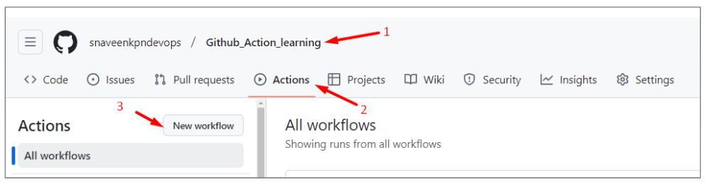


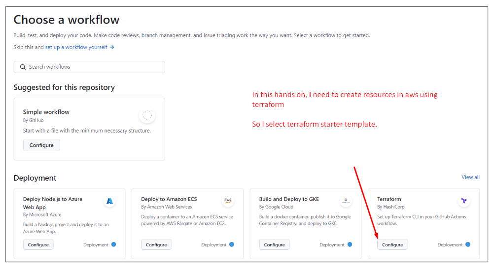


So this is the basic template of terraform.


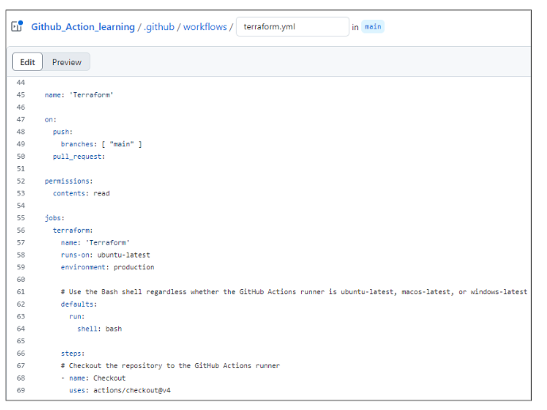


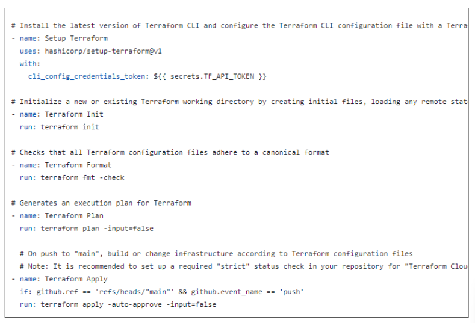


### My-handson for Our Own Starter workflow in Github Action.

If we created our own customize workflow and our organization wants to use that as starter workflow.

### Steps:


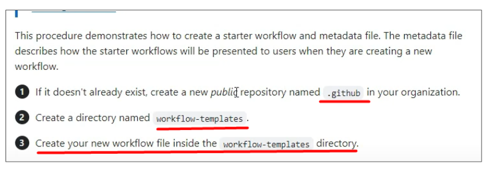


1. Go to Organization

2. Create a new repository (public repository) named .github  in your organization.


3. Click create repository


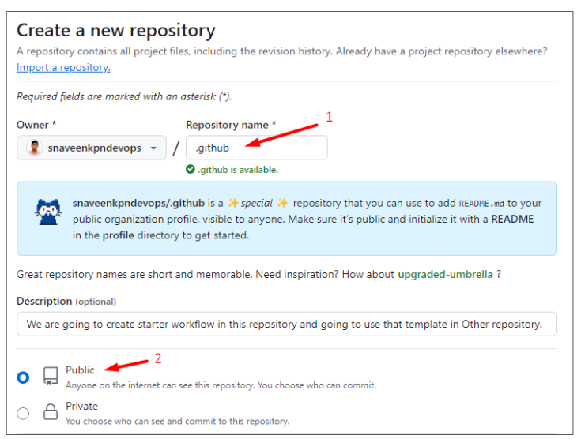


4. Create a folder workflow-templates / my_workflow.yml


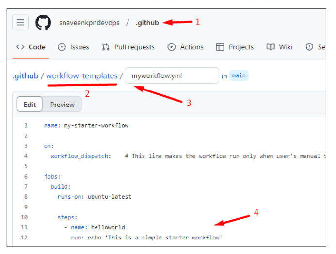


Then we need to create json file also.

6. Create myworkflow.properties.json      →  It Provides metadata about the starter workflow. This is a metadata file. It contains all info about our starter workflow.

[ name & description are required. Other options are optional inside the json file. ]


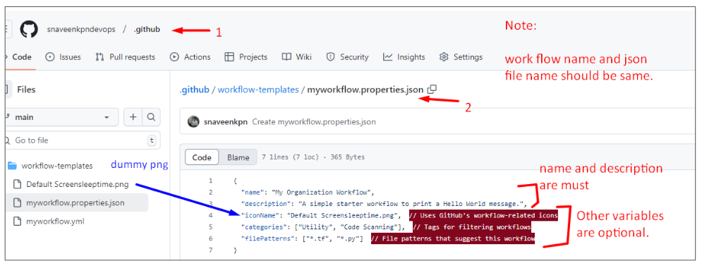


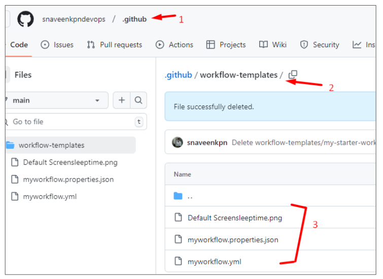


### Checking:

Now Create a new public repository:

Click New repository  →  Name:  test repository (pubic)    →  Click Create Repository   [ Or ] You can check in any of your existing public repository.
Click Actions   →   Now you can able to see your starter workflow in options.
Click Configure.

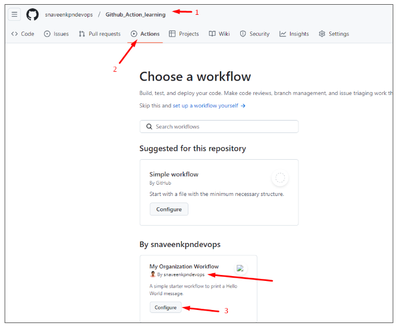


[ Now we can use our own customize workflow. ]


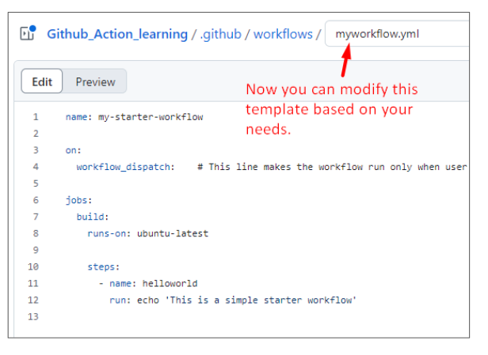


### Note:

1. Starter Workflows created by user can only be used to create workflows in public repositories.

2. Starter `Workflow name` and `json file name` should be same else starter workflow template will not been shown in Starter template.