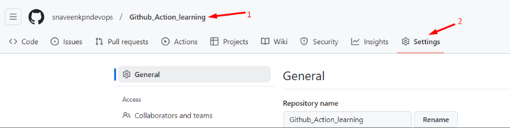
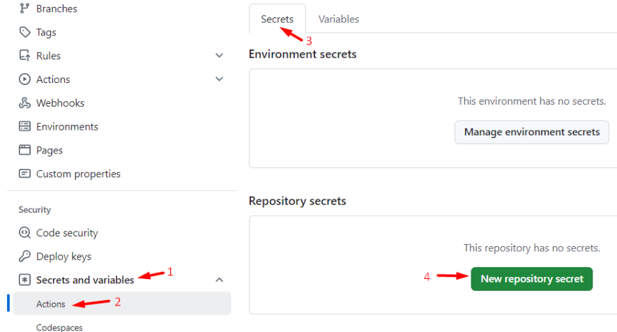
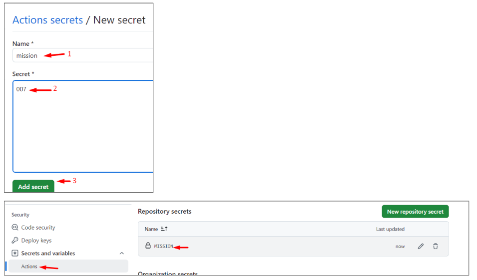
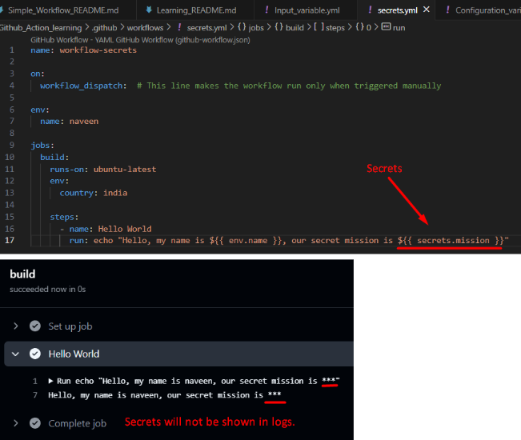

# Github_Action_learning
This repository contains my GitHub learning files, README examples, and related resources.

## Reference:

```
Youtube: TechTrapture
link:  https://www.youtube.com/watch?v=zH8hz_21x_0&list=PLLrA_pU9-Gz2GnvKN0kzVfIZVEUApgjTN
```

## Note:

For Learning the Github Action, Please refer the `Learning_README.md` to check the order of Readme files.


### Variables and Secrets in Github Action

There are few Variable types and secret in Github Action:

1. Workflow Variable  →  Variable that is created and used inside the single workflow.  (local Variable)


2. Configuration Variables for Multiple Workflow   →   Variable used for multiple workflow   (Global Variable)

	                [ These variable are not configured in our yml file but it is defined on organization, repository. ]

3. Context Variables from github metadata  (Most Important Variable)    (Inbuilt Variable)


4. Input for manually triggered variable workflow    


5. Secrets


### 1. Workflow Variable:  [Local Variable]

Variable that is created and used inside the single workflow. These variables cannot be used in other workflows.


```
// .github/workflows/workflow_variable.yml

name: workflow-variable

on:
  workflow_dispatch:  # This line makes the workflow run only when triggered manually

env:
  name: naveen

jobs:
  build:
    runs-on: ubuntu-latest
    env:
      country: india

    steps:
      - name: Hello World
        run: echo "Hello, my name is ${{ env.name }}, I'm from ${{ env.country }}"

```


### 2. Configuration Variable:  [Global Variable]

Variable used for multiple workflow

[ These variable are not configured in our yml file but it is defined on organization, repository. ]


```
// .github/workflows/Configuration_variable.yml

name: Configuration_variable

on:
  workflow_dispatch:  # This line makes the workflow run only when triggered manually

env:
  name: naveen

jobs:
  build:
    runs-on: ubuntu-latest

    steps:
      - name: Hello World
        run: echo "${{ env.name }} from ${{ vars.Department }} department"

```


### 3. Context Variable:  [Inbuilt Variable]

Sometimes you have to get a lot of metadata (name, branch ) etc. from our github.

Let’s say we are giving condition that you have to execute jobs only when branch name is XYZ (or) your workflow name is XYZ (or) your repository name is XYZ. 
So you give a lot of condition there but you cannot define these variable at a runtime. So it should take the current repository name (or) current branch name (or) environment name (or) user name while running your workflow.

`{{ github.repository }}`  →  These are github inbuilt variables.

These are considered as context variables.


```
// .github/workflows/Context_variable.yml

name: Context_variable

on:
  workflow_dispatch:  # This line makes the workflow run only when triggered manually

jobs:
  build:
    runs-on: ubuntu-latest

    steps:
      - name: Hello World
        run: echo "This workflow is in the ${{ github.ref_name }} branch of the ${{ github.repository }} repository"

```


### 4. Input Variable for manually triggered workflow:

Suppose you have to give some value while running workflow you have to mention some parameters while running the workflow. Incase you are running the workflow manually.

Use case:

For Simple Operation,for repetitive task.
We can pass different input for each workflow run.


```
// .github/workflows/Input_variable.yml

name: Input_variable

on:
  workflow_dispatch:
   
    inputs:  # Define inputs under the workflow_dispatch event
      name:
        description: "The name of the user"
        default: "John Doe"
        required: true
      location:
        description: "The location of the user"
        default: "Unknown"
        required: true

jobs:
  build:
    runs-on: ubuntu-latest

    steps:
      - name: Hello World
        run: echo "The name is ${{ github.event.inputs.name }} and the location is ${{ github.event.inputs.location }}"

```


### 5. Secrets:














```
// .github/workflows/Secrets.yml

name: workflow-secrets

on:
  workflow_dispatch:  # This line makes the workflow run only when triggered manually

env:
  name: naveen

jobs:
  build:
    runs-on: ubuntu-latest
    env:
      country: india

    steps:
      - name: Hello World
        run: echo "Hello, my name is ${{ env.name }}, our secret mission is ${{ secrets.mission }}"

```