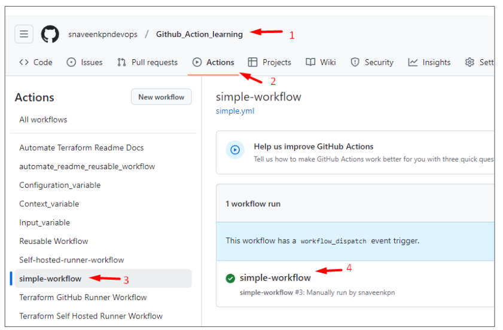
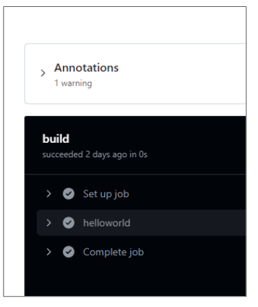
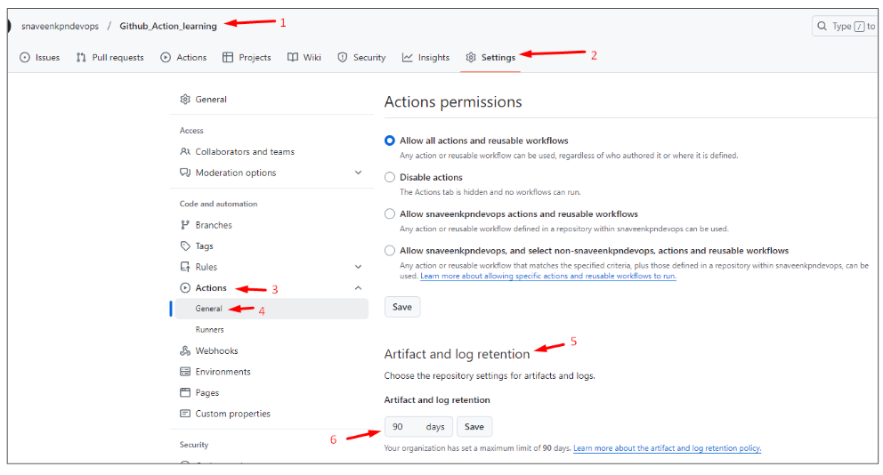
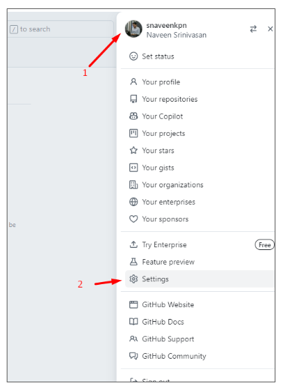
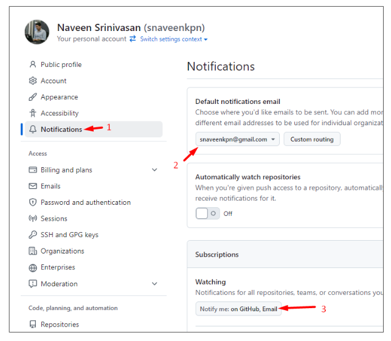
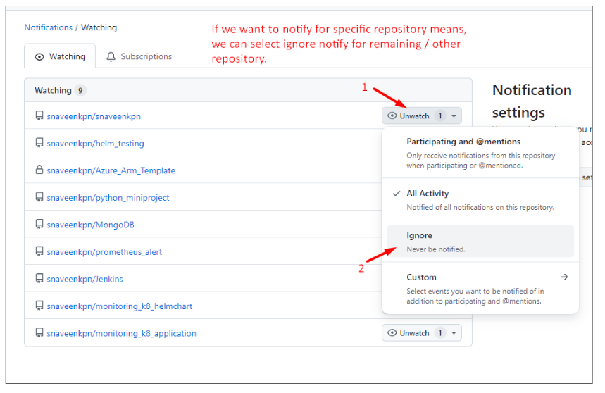
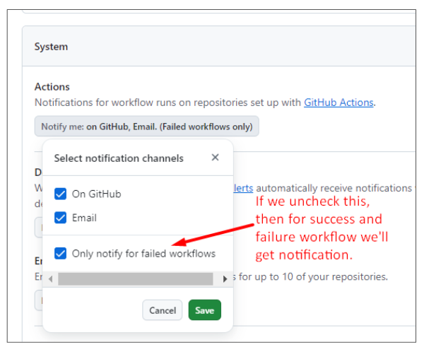

# Github_Action_learning
This repository contains my GitHub learning files, README examples, and related resources.

## Reference:

```
Youtube: TechTrapture
link:  https://www.youtube.com/watch?v=zH8hz_21x_0&list=PLLrA_pU9-Gz2GnvKN0kzVfIZVEUApgjTN

github: https://github.com/vishal-bulbule/Mastering-github-actions

```


## Note:

For Learning the Github Action, Please refer the `Learning_README.md` to check the order of Readme files.


## Logging & Monitoring in Github Actions.

How we can mange alert for failed workflow, successful workflow etc.


### How we can see all Workflow logs:

Go to repository  → Click Action  →  Here you can able to see all workflows status

Click any specific workflow and we can see all logs of that workflow.








### How to config alert:

Go to repository  → Click Settings  →  Click Action Dropdown → Click General

In Artifact & Log Retention  →  Here you can configure log retention period as 90 (or) 60 (or) whatever we need.


### Note:

By default you’ll get notification to your email  if you’re build is successful (or) failed.





### How to Control this notifications:

This Settings is not for repository level. 

Click your Account [ Top Right Nav ]  → Click Settings  →  Click notifications 

* Configure Default Notification email.
* In Watching  →  If we want to watch only few repo means we can uncheck other repository.

* In System  →  Actions  →  Check only notify for failed workflow.


### Note:

In Github we only have basic alerting options. For advanced options we need to integrate with 3rd party tools for monitoring and alerting.











