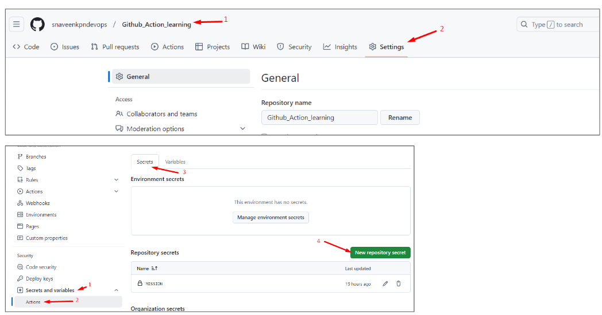
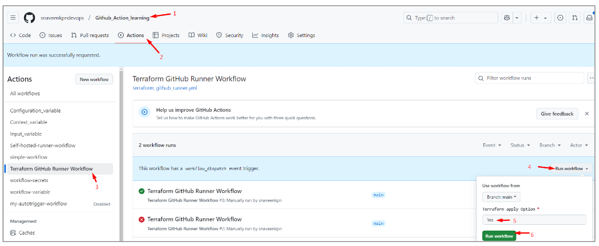

# Github_Action_learning
This repository contains my GitHub learning files, README examples, and related resources.

## Reference:

```
Youtube: TechTrapture
link:  https://www.youtube.com/watch?v=zH8hz_21x_0&list=PLLrA_pU9-Gz2GnvKN0kzVfIZVEUApgjTN
```


## Note:

For Learning the Github Action, Please refer the `Learning_README.md` to check the order of Readme files.


### Terraform Workflow in Github Action:

In this, we will be running our terraform workflow in Github-hosted Runner first, then we will run our terraform workflow in Self-hosted Runner.


### 1. Terraform Workflow in Github-hosted Runner:


Prerequisite:

1. Generate access key and secret key.
2. Create a s3 bucket for storing terraform backend.


Steps:

1. Store access key and secret key in github secrets.
2. Create terraform files inside terraform folder.
3. Create workflow yaml file





```
// .github/workflows/terraform_github_runner.yml

name: Terraform GitHub Runner Workflow

on:
  workflow_dispatch:  # Trigger workflow only on manual dispatch

    inputs:  # Define inputs under the workflow_dispatch event
      apply:
        description: "Terraform apply Option"
        default: "No"
        required: true

jobs:
  terraform:
    name: Terraform Execution
    runs-on: ubuntu-latest  # Or self-hosted, if applicable

    steps:
      # Step 1: Checkout the repository
      - name: Checkout Code
        uses: actions/checkout@v3

      # Step 2: Setup Terraform (This will setup terraform in github runner)
      - name: Setup Terraform
        uses: hashicorp/setup-terraform@v2
        with:
          terraform_version: 1.5.7  # Specify the desired Terraform version

      # Step 3: Configure AWS Credentials
      - name: Configure AWS Credentials
        uses: aws-actions/configure-aws-credentials@v3
        with:
          aws-access-key-id: ${{ secrets.AWS_ACCESS_KEY_ID }}
          aws-secret-access-key: ${{ secrets.AWS_SECRET_ACCESS_KEY }}
          aws-region: ap-south-1  # Replace with your AWS region

      # Step 4: Initialize Terraform
      - name: Terraform Init
        working-directory: ./terraform  # Our terraform files is inside terraform folder
        run: terraform init

      # Step 5: Validate Terraform files
      - name: Terraform Validate
        working-directory: ./terraform
        run: terraform validate

      # Step 6: Terraform Plan
      - name: Terraform Plan
        working-directory: ./terraform
        run: terraform plan -out=tfplan

      # Step 7: Terraform Apply (manual trigger only)
      - name: Terraform Apply
        if: github.event.inputs.apply == 'Yes' || github.event.inputs.apply == 'yes' # Adds a conditional manual apply option
        working-directory: ./terraform
        run: terraform apply -auto-approve tfplan

```





### 2. Terraform running in Self-hosted runner:


Prerequisite:

1. Generate access key and secret key.
2. Create a s3 bucket for storing terraform backend.
3. Make sure to run the Self-hosted runner.
4. In our local machine run → aws configure   [update the credentials]
5. Make Sure that aws cli and terraform is installed 

Steps:

1. Create terraform files inside terraform folder (in our Github repository).
2. Create workflow yaml file


```
// .github/workflows/terraform_self_hosted_runner.yml

name: Terraform Self Hosted Runner Workflow

on:
  workflow_dispatch:  # Trigger workflow only on manual dispatch

    inputs:  # Define inputs under the workflow_dispatch event
      apply:
        description: "Terraform apply Option"
        default: "No"
        required: true

jobs:
  terraform:
    name: Terraform Execution
    runs-on: self-hosted  

    steps:
      # Step 1: Checkout the repository
      - name: Checkout Code
        uses: actions/checkout@v3

      # Step 2: Initialize Terraform
      - name: Terraform Init
        working-directory: ./terraform  # Our terraform files is inside terraform folder
        run: terraform init

      # Step 3: Validate Terraform files
      - name: Terraform Validate
        working-directory: ./terraform
        run: terraform validate

      # Step 4: Terraform Plan
      - name: Terraform Plan
        working-directory: ./terraform
        run: terraform plan -out=tfplan

      # Step 5: Terraform Apply (manual trigger only)
      - name: Terraform Apply
        if: github.event.inputs.apply == 'Yes' || github.event.inputs.apply == 'yes'  # Adds a conditional manual apply option
        working-directory: ./terraform
        run: terraform apply -auto-approve tfplan

```


